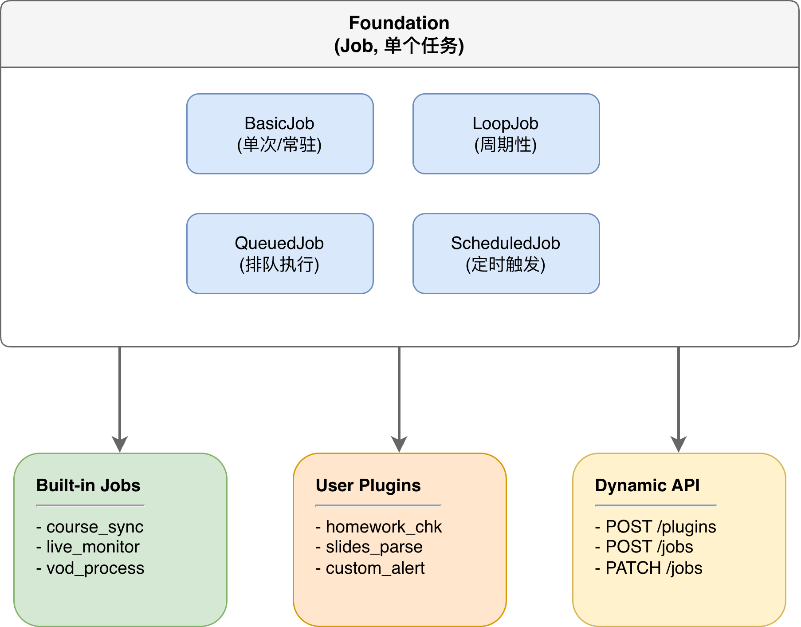

# AutoCanvas Gateway

AutoCanvas Gateway 是一个基于 Python 的异步任务调度系统，专为自动化 Canvas LMS 视频处理而设计。它能够自动监控直播课程、转录点播视频，并提供灵活的插件系统用于功能扩展。

## 功能特性

- **全自动直播监控**: 自动检测即将开始的直播，提前10分钟启动监听
- **智能语音识别**: 基于 Qwen3-ASR 0.6B 模型的实时语音转文字
- **关键词告警**: 实时检测 "签到"、"点名"、"名字" 等关键词
- **VOD 回放转录**: 自动或手动处理课程回放视频
- **灵活的 Job 调度系统**: 支持周期性、定时、排队等多种任务类型
- **动态插件系统**: 无需重启即可上传和运行自定义插件
- **完整的 HTTP API**: 提供 RESTful 接口管理所有功能

## 项目结构

```
AutoCanvas/
├── gateway.py              # 核心 Gateway 类，异步调度器
├── start_gateway.py        # 服务启动入口
├── config.py               # 配置文件（直播监听参数）
│
├── jobs/                   # Job 调度层
│   ├── __init__.py
│   ├── job_manager.py      # JobRegistry 基础管理
│   ├── builtin_jobs.py     # 内置任务（课程同步、直播扫描、调度执行）
│   ├── schedule_manager.py # Schedule 管理
│   ├── auto_scheduler.py   # 自动化调度器
│   └── video_gateway_jobs.py # 视频相关 Job 注册
│
├── workers/                # 工作层
│   ├── __init__.py
│   ├── live_worker.py      # 直播监听处理
│   ├── replay_worker.py    # VOD 转写处理
│   └── video_manager.py    # 视频状态管理
│
├── api/                    # API 层
│   ├── __init__.py
│   ├── video_api.py        # HTTP API 服务
│   └── canvas_video.py     # Canvas API 封装
│
├── utils/                  # 工具层
│   ├── __init__.py
│   ├── canvas_auth.py      # Canvas 认证与 Session 管理
│   └── course_data.py      # 课程数据管理
│
├── plugins/                # 插件目录
│   └── example_homework_check.py  # 示例插件
│
├── data/                   # 数据持久化（自动创建）
│   ├── jobs_state.json     # Job 状态
│   ├── video_state.json    # 视频元数据
│   ├── schedules.json      # 调度记录
│   ├── timetable.json      # 课程表
│   └── stream_labels.json  # 流类型缓存
│
├── transcript/             # 转写输出目录（自动创建）
├── logs/                   # 日志目录（自动创建）
│   └── gateway.log         # 主日志文件
│
├── docs/                   # 文档目录
│   ├── qwen3-asr-model-card.md
│   └── jaccount-login-pipeline.md
│
├── TODO.md                 # 开发任务清单
├── ARCHITECTURE.md         # 架构设计文档
└── README.md               # 本文档
```

## 系统架构

### 核心架构 (Foundation Layer)



**组件说明：**

| 层级 | 组件 | 功能 |
|------|------|------|
| Foundation | JobRegistry | 任务注册中心，管理所有 Job |
| Job 类型 | BasicJob | 单次执行或长期驻留 |
| | LoopJob | 周期性执行（如每30分钟） |
| | QueuedJob | 排队执行，并发控制 |
| | PluginJob | 动态加载 Python 脚本 |
| 应用层 | Built-in Jobs | course_sync, live_monitor, vod_process |
| | User Plugins | 用户自定义插件 |
| | Dynamic API | RESTful 接口管理所有功能 |

### 完整数据流

```
Gateway (AutoCanvasGateway)
├─ Loop 层: 周期性任务 (auto_scheduler.py)
│   └─ 每周同步课程表 (update_timetable, 7天间隔)
│   └─ 每小时扫描直播 (scan_live, 1小时间隔)
│   └─ 每分钟执行调度 (schedule_executor, 1分钟间隔)
│
├─ Schedule 层: 精确时间触发 (schedule_manager.py)
│   └─ monitor_start: 课前10分钟触发，启动直播监听
│   └─ monitor_end: 课程结束触发，停止监听并整理
│
├─ Queue 层: 待处理队列 (video_manager.py)
│   └─ VOD Queue: 待转写/处理中/已完成/跳过
│   └─ Live Queue: 直播监听状态
│
└─ Job 层: 正在执行的任务 (gateway.py)
    └─ 直播监听 Job (长驻，支持断线重连)
    └─ VOD 转写 Job (一次性)
    └─ API Server Job (常驻)
```

### 全自动工作流程

```
1. Gateway 启动
   └─ Session 初始化（Canvas 认证）
   └─ JobRegistry 初始化
   └─ 注册内置 Job（update_timetable, scan_live, schedule_executor）
   └─ 启动 API Server

2. 每周执行（Loop 层 - update_timetable）
   └─ 同步 Canvas 课程表
   └─ 存储到 data/timetable.json

3. 每小时执行（Loop 层 - scan_live）
   └─ 获取所有课程的直播列表
   └─ 筛选未来 24h 内的直播
   └─ 为每个直播注册 Schedule:
       ├─ monitor_start: 课前10分钟触发
       └─ monitor_end: 课程结束触发

4. 每分钟执行（Loop 层 - schedule_executor）
   └─ 检查待触发的 Schedule
   └─ monitor_start 触发:
       └─ 启动 live_monitor Job（QueuedJob）
           └─ ffmpeg 拉流 → ASR 识别 → 关键词检测
           └─ 输出到 transcript/xxx-stream.txt
   └─ monitor_end 触发:
       └─ 停止对应的 live_monitor Job
       └─ 扫描该课程的新回放

5. VOD 处理（手动或自动）
   └─ 通过 API 手动触发，或自动加入队列
   └─ VOD 转写 Job（QueuedJob，避免并发冲突）
       └─ 音频感知选流 → ffmpeg 拉流 → ASR 识别
       └─ 输出到 transcript/xxx-replay.txt
```

## 快速开始

### 环境要求

- Python 3.10+
- Conda 或虚拟环境
- FFmpeg（系统路径可访问）
- macOS / Linux（推荐）

### 安装依赖

```bash
# 创建 conda 环境
conda create -n auto-canvas python=3.12
conda activate auto-canvas

# 安装 Python 依赖
pip install qwen-asr torch requests numpy aiohttp
```

### 配置

编辑 `config.py`：

```python
# 登录配置（可选，首次运行会提示登录）
DEFAULT_USERNAME = "your_email@sjtu.edu.cn"

# Live 直播监听配置
LIVE_CONFIG = {
    "keywords": ["签到", "点名", "名字"],    # 关键词检测
    "silence_threshold": 0.005,               # 静音阈值
    "chunk_seconds": 3,                       # 音频切片长度
    "sample_rate": 16000,                     # 采样率
    "keyword_debounce_seconds": 30,           # 关键词去抖动
}
```

### 启动服务

```bash
conda activate auto-canvas
python start_gateway.py
```

服务启动后：
- API 监听 `http://0.0.0.0:8080`
- 日志输出到 `logs/gateway.log`

### 验证运行

```bash
# 健康检查
curl http://localhost:8080/health

# 查看所有 Job
curl http://localhost:8080/jobs

# 查看课程视频列表
curl "http://localhost:8080/videos?course_id=YOUR_COURSE_ID"
```

## API 文档

### 系统管理

#### 健康检查
```bash
GET /health
```

响应：
```json
{
  "success": true,
  "started_at": "2026-04-03T10:00:00",
  "last_heartbeat": "2026-04-03T10:05:00",
  "jobs_count": 5
}
```

### Job 管理

#### 列出所有 Job
```bash
GET /jobs?type=loop
```

Query 参数：
- `type` (可选): `basic`, `loop`, `scheduled`, `queued`

#### 获取 Job 详情
```bash
GET /jobs/{name}
```

#### 更新 Job 配置
```bash
PATCH /jobs/{name}
Content-Type: application/json

{
  "enabled": true,
  "interval": 3600,
  "retries": 3,
  "retry_delay": 5.0
}
```

#### 暂停/恢复 Job
```bash
POST /jobs/{name}/pause
POST /jobs/{name}/resume
```

#### 启动 Job
```bash
POST /jobs/{name}/start
```

#### 删除 Job
```bash
DELETE /jobs/{name}
```

### Canvas 视频操作

#### 获取课程视频列表
```bash
GET /videos?course_id=YOUR_COURSE_ID
```

响应：
```json
{
  "success": true,
  "course_id": "YOUR_COURSE_ID",
  "live": [...],
  "vod": [...]
}
```

#### 手动同步课程
```bash
POST /canvas/sync
Content-Type: application/json

{
  "course_id": YOUR_COURSE_ID
}
```

#### 手动启动直播监听
```bash
POST /canvas/live/monitor
Content-Type: application/json

{
  "course_id": YOUR_COURSE_ID,
  "lecture_id": "xxx"
}
```

#### 将 VOD 加入转写队列
```bash
POST /canvas/vod/queue
Content-Type: application/json

{
  "course_id": YOUR_COURSE_ID,
  "video_id": "xxx",
  "priority": 0
}
```

### 队列管理

#### VOD 队列操作

```bash
# 获取 VOD 队列列表
GET /queue/vod?course_id=YOUR_COURSE_ID

# 重置 VOD 转写状态
POST /queue/vod
Content-Type: application/json

{
  "course_id": YOUR_COURSE_ID,
  "video_id": "xxx",
  "action": "reset"
}

# 跳过 VOD 转写
POST /queue/vod
Content-Type: application/json

{
  "course_id": YOUR_COURSE_ID,
  "video_id": "xxx",
  "action": "skip"
}
```

#### 直播队列操作

```bash
# 获取直播队列列表
GET /queue/live?course_id=YOUR_COURSE_ID

# 手动启动直播监听
POST /queue/live
Content-Type: application/json

{
  "course_id": YOUR_COURSE_ID,
  "lecture_id": "xxx",
  "action": "monitor"
}

# 停止直播监听
POST /queue/live
Content-Type: application/json

{
  "course_id": YOUR_COURSE_ID,
  "lecture_id": "xxx",
  "action": "stop"
}
```

### Schedule 管理

```bash
# 获取所有 Schedule
GET /schedules?course_id=YOUR_COURSE_ID

# 获取待执行的 Schedule
GET /schedules/pending

# 取消 Schedule
POST /schedules/{id}/cancel
```

### 插件管理

#### 列出可用插件
```bash
GET /plugins
```

#### 上传并注册插件
```bash
POST /plugins
Content-Type: application/json

{
  "name": "homework_check",
  "code": "async def run(gateway): gateway.logger.info('Checking...')",
  "job_type": "basic",
  "auto_start": true
}
```

参数说明：
- `name`: 插件名称（唯一标识）
- `code`: Python 代码内容
- `job_type`: `basic`, `loop`, `queued`
- `interval`: Loop Job 的间隔秒数
- `auto_start`: 是否立即启动

## 插件开发

### 最小插件

创建一个最简单的插件：

```python
async def run(gateway):
    """必须实现的入口函数"""
    gateway.logger.info("Hello from plugin!")
```

### 完整插件示例

```python
from datetime import datetime

async def run(gateway):
    """Job 执行入口"""
    logger = gateway.logger
    session = gateway.session
    
    logger.info("[my_plugin] 开始执行...")
    
    # 使用 session 调用 Canvas API
    # 使用 gateway.run_sync() 执行同步代码
    # 使用 gateway.job_registry 操作其他 Job
    
    logger.info("[my_plugin] 执行完成")

async def setup(gateway):
    """可选: 插件加载时调用"""
    gateway.logger.info("[my_plugin] 已加载")

async def teardown(gateway):
    """可选: 插件卸载时调用"""
    gateway.logger.info("[my_plugin] 已卸载")
```

### 上传插件示例

```bash
curl -X POST http://localhost:8080/plugins \
  -H "Content-Type: application/json" \
  -d '{
    "name": "daily_report",
    "code": "async def run(g): g.logger.info('Daily report')",
    "job_type": "loop",
    "interval": 86400,
    "auto_start": true
  }'
```

## 配置说明

### 直播监听配置 (`config.py`)

| 参数 | 类型 | 默认值 | 说明 |
|------|------|--------|------|
| `keywords` | list | `["签到", "点名", "名字"]` | 关键词检测列表 |
| `silence_threshold` | float | 0.005 | 静音阈值，低于此值跳过 |
| `chunk_seconds` | int | 3 | 音频切片长度（秒） |
| `sample_rate` | int | 16000 | 音频采样率 |
| `keyword_debounce_seconds` | int | 30 | 关键词告警去抖动时间 |
| `enable_qr_detection` | bool | False | 是否启用二维码检测 |
| `qr_debounce_seconds` | int | 60 | 二维码检测去抖动时间 |

### ASR 模型配置

ASR 模型在 `replay_worker.py` 中配置：

```python
_asr_model = Qwen3ASRModel.from_pretrained(
    "Qwen/Qwen3-ASR-0.6B",
    device_map="mps",  # macOS 使用 MPS，Linux 可改为 "cuda" 或 "cpu"
)
```

## 数据文件

所有状态数据存储在 `data/` 目录下：

### timetable.json
存储用户的课程表：
```json
{
  "courses": [
    {"id": "YOUR_COURSE_ID", "name": "高等数学"}
  ],
  "updated_at": "2026-04-03T10:00:00"
}
```

### schedules.json
存储直播调度记录：
```json
{
  "schedules": [
    {
      "id": "monitor_start_COURSE_ID_xxx",
      "type": "monitor_start",
      "course_id": "YOUR_COURSE_ID",
      "lecture_id": "xxx",
      "trigger_at": "2026-04-03T08:50:00",
      "status": "pending",
      "metadata": {...}
    }
  ]
}
```

### video_state.json
存储视频元数据：
```json
{
  "courses": {
    "YOUR_COURSE_ID": {
      "live": [...],
      "vod": [...]
    }
  }
}
```

## 转写输出

转写文件输出到 `transcript/` 目录：

### 文件名格式
- 直播: `yymmdd-HHMM-{课程名}-stream.txt`
- 回放: `yymmdd-HHMM-{课程名}-replay.txt`

### 文件格式
```
# 课程: 高等数学
# 教师: 张三
# 开始时间: 2026-04-03T09:00:00
# 流地址: rtmp://...
----------------------------------------
[00:00:03] 同学们好，今天我们讲
[00:00:06] 请翻到课本第23页
[00:00:09] 这里有个重要的定理
...
```

## 常见问题

### Q: 如何手动触发课程同步？
```bash
curl -X POST http://localhost:8080/canvas/sync \
  -H "Content-Type: application/json" \
  -d '{"course_id": YOUR_COURSE_ID}'
```

### Q: 如何查看待执行的 Schedule？
```bash
curl "http://localhost:8080/schedules/pending?course_id=YOUR_COURSE_ID"
```

### Q: 如何重置 VOD 转写状态？
直接修改 `data/video_state.json` 中对应 VOD 的 `transcribed` 字段为 `false`，或重新启动 Gateway。

### Q: 如何调试 Job？
查看 `logs/gateway.log` 获取详细日志：
```bash
tail -f logs/gateway.log
```

### Q: Session 过期怎么办？
Gateway 会自动检查并刷新 Session。如需手动重新登录，删除 `canvas_session.json` 后重启 Gateway。

## 开发计划

### 已完成
- [x] Gateway 常驻异步调度器
- [x] 5 种 Job 类型（Basic/Loop/Scheduled/Queued/Plugin）
- [x] 全自动直播监听与转录
- [x] VOD 回放转写
- [x] 关键词实时检测
- [x] HTTP API 完整支持
- [x] 插件系统
- [x] 状态持久化

### 进行中
- [ ] 多课程并行监控优化
- [ ] 关键词告警通知（iMessage/邮件/钉钉）

### 待开发
- [ ] 实时字幕输出（SRT/WebVTT）
- [ ] 课程摘要自动生成（LLM总结）
- [ ] 课程内容全文搜索
- [ ] Prometheus 指标导出
- [ ] Grafana 监控面板

## 架构设计原则

1. **单一职责**: Job 是最小执行单元，只做一件事
2. **可组合**: 不同类型的 Job 可以组合使用
3. **可扩展**: Plugin 系统允许动态添加功能
4. **可观测**: 所有 Job 状态可查询、可控制
5. **容错**: 支持重试、失败恢复、手动干预

## 许可证

MIT License

## 相关文档

- [ASR 模型说明](docs/qwen3-asr-model-card.md)
- [JAccount 登录流程](docs/jaccount-login-pipeline.md)
- [架构设计](ARCHITECTURE.md)
- [任务清单](TODO.md)
